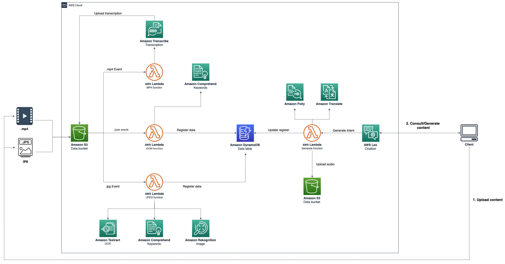

## AWS Brazil Tech Talk 2019 AI Services Demo

The purpose of this demo is show how to use some AWS AI services. We are going to construct a chatbot to upload images and videos extracting more information from the content to turn easier to search them and generate audio files about them.

Below we have the architecture of this demo:



To get started you will need an IAM user with the following access:
- CloudFormation
- S3
- IAM
- DynamoDB
- Lambda
- Transcribe
- Textract
- Rekognition
- Comprehend
- Translate
- Polly
- Lex

_Notes:_ 
* _The purpose of this demo is to demonstrate AWS AI services. The code used is not for production._
* _Tested in the N. Virginia region (us-east-1)._

### Before start, clone or download the repository!

## CloudFormation
1. Open the CloudFormation console at https://console.aws.amazon.com/cloudformation
2. On the Welcome page, click on **Create stack** button
3. On the Step 1 - Specify template: Choose Upload a template file, click on **Choose file** button and select the **cloudformation.yaml** located inside deploy directory
4. On the Step 2 - Specify stack details: Enter the Stack name as **'ai-bot'**
5. On the Step 3 - Configure stack options: Just click on **Next** button
6. On the Step 4 - Review: Enable the checkbox **I acknowledge that AWS CloudFormation might create IAM resources with custom names.**, and click on **Create Stack** button
7. Wait for the stack get into status **CREATE_COMPLETE**
8. Under the Outputs tab, take a note of **Cognito Identity Pool ID**, **Account ID**, **IAM Role Name** and **S3 Bucket Name**
  
## Lambda
1. Open the Lambda console at https://console.aws.amazon.com/lambda
2. Click on **Create function** button, enter the name as **jpeg_function**
3. Select **Python 3.7** in **Runtime**
4. Under **Permissions** section, select **Use an existing role** and search for the **IAM Role Name** that we noted
5. Copy the code from the script **jpeg_function.py** file inside lambda directory and paste it in **Function code**
6. On **Basic Settings** increase the **Timeout** to 10 seconds
7. Click on **Save** button
8. Repeat this step for all Lambda functions of lambda directory

_Note: For "generate function" you will need to change the bucket name inside code_

## S3
1. Open the S3 console at https://console.aws.amazon.com/s3
2. Select the S3 bucket name we noted
3. Go to **Properties** tab
4. Click on **Events** section
5. Create three different events as in the architecture (.mp4, .json, .jpg):
   * Insert any name
   * Click on **Add notification**
   * Select **All object create events**
   * Specify **.jpg** in **Suffix**
   * Select **Send to** Lambda function
   * Specify **jpeg_function** in **Lambda**
   * Repeat for .mp4 and .json
6. Go to **Permissions** and update CORS configuration for public access:
```
<?xml version="1.0" encoding="UTF-8"?>
<CORSConfiguration xmlns="http://s3.amazonaws.com/doc/2006-03-01/">
<CORSRule>
    <AllowedOrigin>*</AllowedOrigin>
    <AllowedMethod>HEAD</AllowedMethod>
    <AllowedMethod>GET</AllowedMethod>
    <AllowedMethod>PUT</AllowedMethod>
    <AllowedMethod>POST</AllowedMethod>
    <AllowedMethod>DELETE</AllowedMethod>
    <AllowedHeader>*</AllowedHeader>
</CORSRule>
</CORSConfiguration>
```

## Lex
1. Open the Lex console at https://console.aws.amazon.com/lex
2. Click on **Actions** and import the lex.zip file located in deploy directory
3. Select Consult Intent and add **Fullfiment** Lambda function and select **consult_function**
4. Click on **Save Intent**
5. Select Generate Intent and add **Fullfiment** Lambda function and select **generate_function**
6. Click on **Save Intent**
7. Build the bot
8. Publish with alias **prod**

## Test and modify the application ##
1. Open cognito_script located in web/js/ directory and change the **Cognito Identity Pool ID**
2. Open s3_script located in web/js/ directory and change **Bucket name**
3. Access the application opening the **index.html** located in web directory
4. Test it:
   * Say help to the bot
   * Upload a new file (you can use sample files located in samples directory)
   * Say summary and type some keyword
   * Utilize the content id to generate audio files
   * donwload and listen the audo file
5. Now that the application is running, try to change the lambda function to generate an audio file in spanish!

## Clean up
1. Delete Lambda functions
2. Delete Lex chatbot
3. Delete DynamoDB table
4. Clean S3 bucket
5. Select **ai-bot** stack on CloudFormation and click on **Delete** button

## Reference links
* Python boto3: https://boto3.amazonaws.com/v1/documentation/api/latest/index.html?id=docs_gateway
* JS SDK: https://docs.aws.amazon.com/AWSJavaScriptSDK/latest/_index.html
* AWS CLI: https://docs.aws.amazon.com/cli/latest/userguide/cli-chap-install.html
* AWS AI: https://aws.amazon.com/ai/?nc1=h_ls

## License summary
This sample code is made available under the MIT-0 license. See the LICENSE file.
